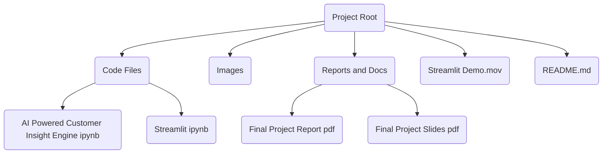

# AI Powered Customer Insight Engine for Beauty Brands

AI Powered Customer Insight Engine for Beauty Brands is a data science oriented project that appears to explore customer insights for beauty brands using notebooks and accompanying media. The repository contains exploratory Jupyter notebooks, visual assets, and documentation artifacts that suggest a workflow around analyzing customer data and presenting findings, potentially via a Streamlit based workflow.

## Architecture Overview

## Tech Stack

- No explicit configuration files detected in the repository to define a formal tech stack.
- Observed artifacts imply a Python data science workflow, with Jupyter notebooks and potential Streamlit usage suggested by the notebook titles.
- Media and document formats present include PNG images, PDFs, PowerPoint PDFs, and a MOV video, indicating reporting and demonstration material accompanying the data work.

Notes:
- If you want precise dependency and environment details, consider adding configuration files such as requirements.txt, pyproject.toml, Dockerfile, or Makefile to solidify the tech stack.

## Getting Started / How to Run

This repository does not contain runnable configuration files such as package.json, pyproject.toml, requirements.txt, Dockerfile, or Makefile. There are two notebooks in the code files folder which appear to be the primary artifacts for exploration and demonstration.

- No official run scripts are defined in this repository.
- To work with the notebooks locally, you can set up a Python environment and open them with a Jupyter-compatible interface.

Suggested manual steps (generic guidance):
- Install Python 3.x
- Install Jupyter or JupyterLab (example commands, not provided by this repo)
  - pip install jupyterlab
- Run JupyterLab and open the notebooks located in code files
  - jupyter lab "code files/AI Powered Customer Insight Engine for Beauty Brands.ipynb"
  - jupyter lab "code files/Streamlit (1).ipynb"
- View the accompanying images and reports in their respective folders for context

Note: These steps are general notebook usage guidelines since the repository does not include explicit runnable scripts or environment configuration.

## Project Structure

- code files
  - AI Powered Customer Insight Engine for Beauty Brands.ipynb
  - Streamlit (1).ipynb
- images
  - Screenshot 2025-05-16 at 12.56.54.png
  - Screenshot 2025-05-16 at 12.57.10.png
  - Screenshot 2025-05-16 at 12.57.28.png
  - Screenshot 2025-05-16 at 12.58.25.png
- annotated-BUDT%20751%20-%20501%20-%20FinalProject%2030%20-%20Final%20Report.docx.pdf
- annotated-Final%20Project%20Slides.pptx.pdf
- README.md
- Streamlit Demo.mov

Key directories and files are primarily notebooks for exploration, media assets for demonstration, and documentation artifacts that accompany the analysis.

## Contributing

We welcome contributions. To propose changes:

- Fork the repository
- Create a feature branch: git checkout -b feature/your-change
- Make your changes (code files, notebooks, docs)
- Run basic checks locally (e.g., open notebooks to verify readability)
- Submit a pull request with a clear description of the changes

Code of Conduct:
- Be respectful and collaborative
- Report issues constructively
- Follow common open source contribution practices

End of README